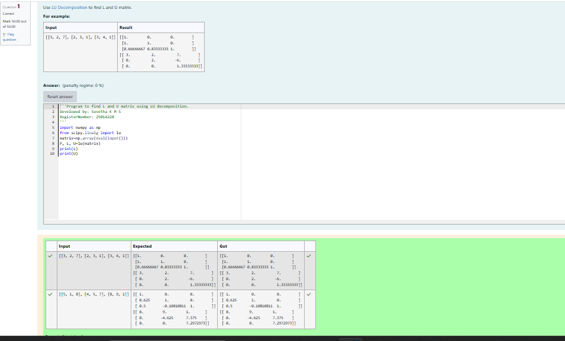
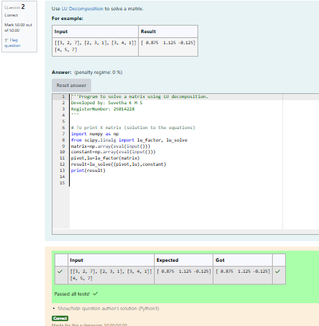

# LU Decomposition 

## AIM:
To write a program to find the LU Decomposition of a matrix.

## Equipments Required:
1. Hardware – PCs
2. Anaconda – Python 3.7 Installation / Moodle-Code Runner

## Algorithm
1. 
Import the numpy module to use the built-in functions for calculation

2. Prepare the lists from each linear equations and assign in np.array()

3. Using the lu(), we get the results  of the given matrix.

4.End the programs 

## Program:
(i) To find the L and U matrix
```
/*
Program to find the L and U matrix.
Developed by: Suvetha K M S
RegisterNumber: 25014228
*/
```
import numpy as np

from scipy.linalg import lu

matrix=np.array(eval(input()))

P, L, U=lu(matrix)

print(L)

print(U)

(ii) To find the LU Decomposition of a matrix
```
/*
Program to find the LU Decomposition of a matrix.
Developed by: Suvetha K M S
RegisterNumber:25014228 
*/
```
import numpy as np

from scipy.linalg import lu_factor, lu_solve

matrix=np.array(eval(input()))

constant=np.array(eval(input()))

pivot,lu=lu_factor(matrix)

result=lu_solve((pivot,lu),constant)

print(result)

## Output:


## Result:
Thus the program to find the LU Decomposition of a matrix is written and verified using python programming.

